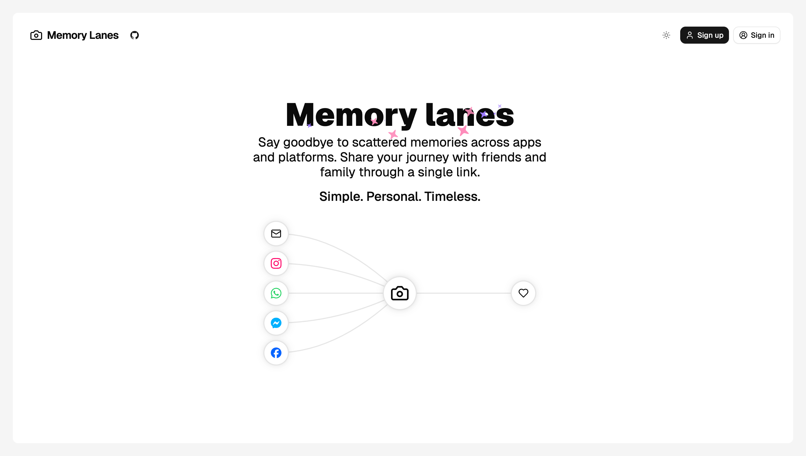
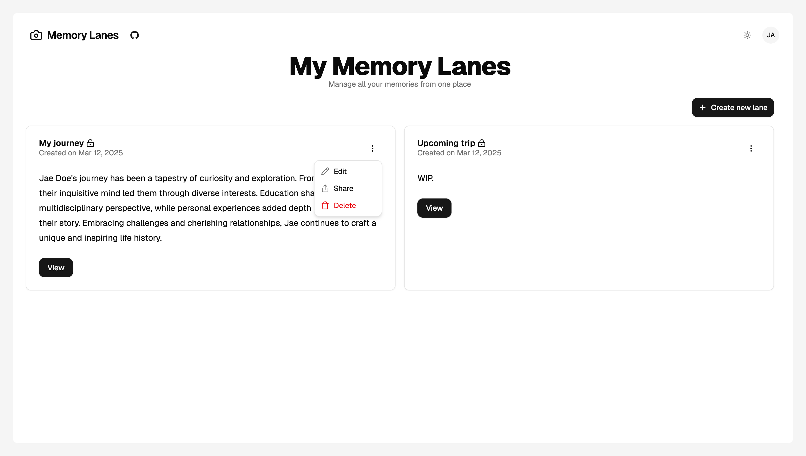
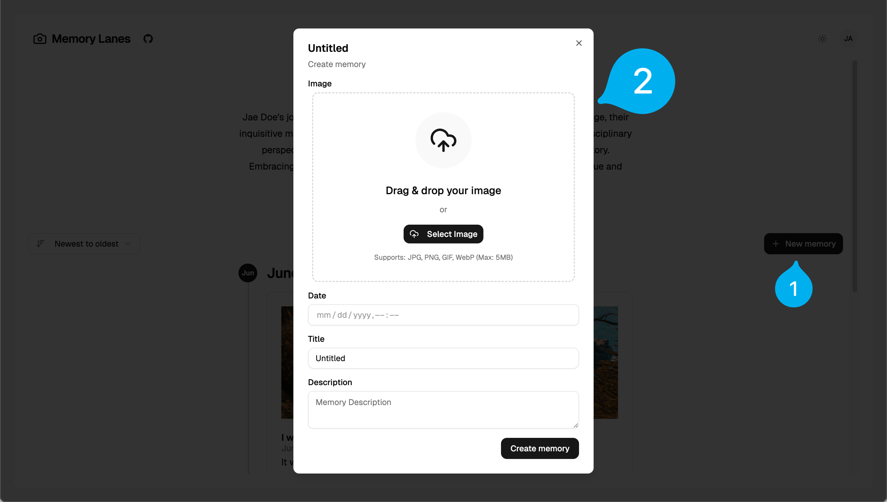
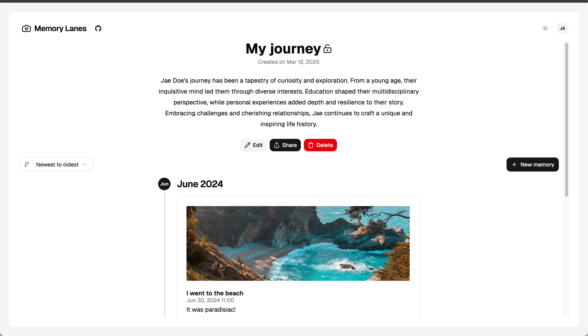
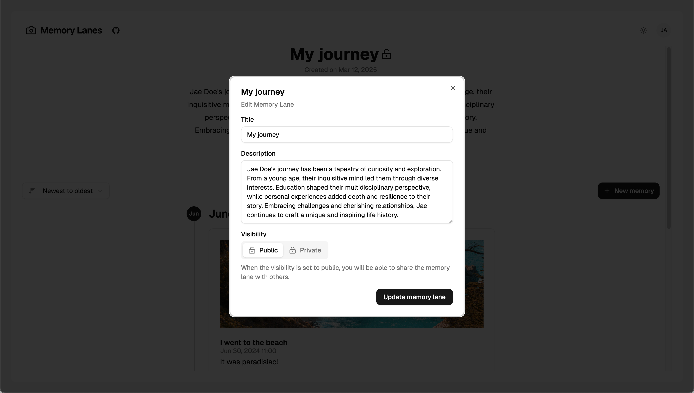
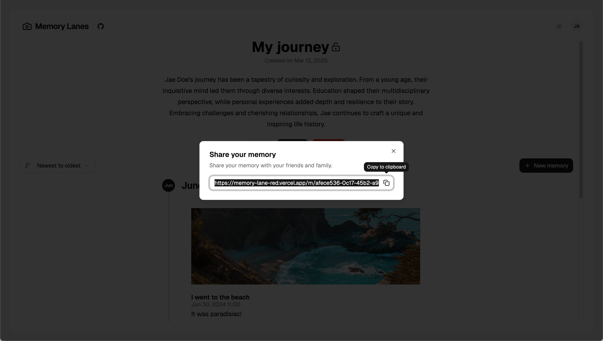
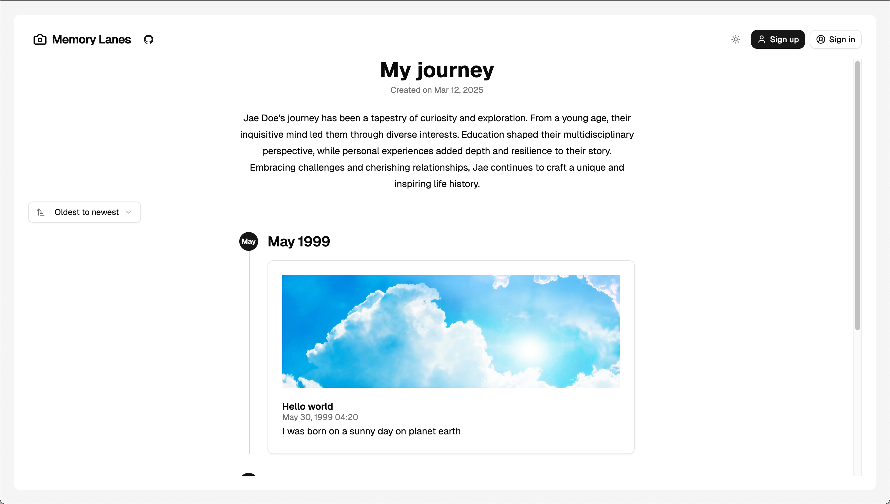
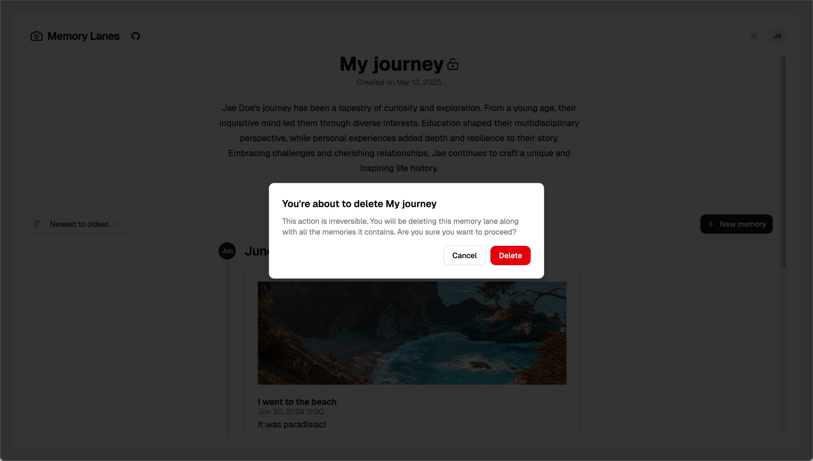

<h1 align="center">Memory Lane</h1>

<p align="center">
 A web application to create and share memory lanes with friends and family
</p>

<p align="center">
  <a href="#about"><strong>About</strong></a> ·
  <a href="#features"><strong>Features</strong></a> ·
  <a href="#tech-stack"><strong>Tech Stack</strong></a> ·
  <a href="#implementation"><strong>Implementation</strong></a> ·
  <a href="#local-development"><strong>Local Development</strong></a>
</p>
<br/>



## About

Memory Lane is a web application designed to simplify sharing memories with friends and family. Instead of relying on multiple platforms like social media, messaging apps, and email, users can create a "memory lane" — a chronological collection of memories with titles, descriptions, timestamps, and images — and share it via a single link.

This first iteration focuses on a seamless user experience, leveraging Supabase for authentication and storage, and tRPC for type-safe API interactions.

## Features

- **Manage Memory Lanes**: Define a memory lane with a title and description.
- **Manage memories**: Include memories with titles, descriptions, timestamps, and at least one image, displayed chronologically.
- **Share Easily**: Generate a shareable link for friends and family.
- **Responsive UI**: Optimized for both desktop and mobile.
- **Image Upload**: Drag-and-drop or file picker support, stored via Supabase Storage.

## Tech Stack

- **Framework**: [Next.js 15](https://nextjs.org) with App Router for a modern React setup.
- **Database**: [Supabase](https://supabase.com) with PostgreSQL and built-in auth.
- **File Storage**: [Supabase Storage](https://supabase.com/docs/guides/storage) for image uploads.
- **API**: [tRPC](https://trpc.io) for type-safe, single-endpoint API with routers.
- **State Management**: [TanStack Query](https://tanstack.com/query) for efficient data fetching and caching.
- **UI Components/Styling**: [Shadcn UI](https://ui.shadcn.com/) with [Tailwind CSS](https://tailwindcss.com) v4 for reusable components.

## Implementation

### Technical Design

- **Frontend**: Built with Next.js for server-side rendering and a smooth user experience. Key pages include a homepage for managing memory lanes and a detail page for viewing (and managing) memories in a timeline (depending on auth).
- **API with tRPC**: The API leverages tRPC's single-endpoint architecture with routers for:
  - No traditional REST verbs (GET/POST) are used; tRPC handles queries and mutations seamlessly.
  - **Users Router**:
    - `users.getUser`: Get authenticated user's name and avatar.
    - `users.isLoggedIn`: Check if a user is currently logged in.
    - `users.updateUser`: Update user profile information.
  - **Memory Lanes Router**:
    - `memoryLanes.getAll`: Retrieves all memory lanes for the authenticated user.
    - `memoryLanes.getById`: Get a specific memory lane by ID with ownership status.
    - `memoryLanes.checkHasAccess`: Verify if current user has access to a memory lane.
    - `memoryLanes.create`: Create a new memory lane with title and description.
    - `memoryLanes.update`: Update an existing memory lane's details.
    - `memoryLanes.delete`: Delete a memory lane and all associated memories.
  - **Memories Router**:
    - `memories.getAll`: Get all memories for a lane, chronologically sorted and grouped by month/year.
    - `memories.create`: Add a new memory with title, description, date, and image.
    - `memories.update`: Update an existing memory's details.
    - `memories.delete`: Delete a memory from a lane and remove associated files.
- **Data Model**:
  - `MemoryLanes`: `{ id, title, description, createdAt, userId, visibility }`
  - `Memories`: `{ id, laneId, title, description, date (timestamp), image }`
- **Authentication**: Handled via Supabase Auth, ensuring only authenticated users can create and manage memory lanes.
- **Image Handling**: Images are uploaded to Supabase Storage via a drag-and-drop interface, with URLs stored in the database for retrieval.
- **Reusability**: Modular components like `MemoryCard`, `MemoryLaneCard`, `UploaderField` etc... along with, where it makes sense, other reusable components.

### Folder Structure

The project follows a modular, feature-oriented structure that optimizes for code colocation and maintainability:

```
memory-lane/
├── src/                     # Main source code
│   ├── app/                 # Next.js App Router structure
│   │   ├── (app)/           # Main app routes (protected)
│   │   ├── api/             # API routes, including tRPC
│   │   ├── auth/            # Authentication-related routes
│   │   └── styles/          # Global styles
│   ├── auth/                # Authentication utilities and types (Supabase)
│   ├── components/          # Reusable UI components
│   │   ├── fields/          # Form field components
│   │   ├── magicui/         # Animation and UI effects
│   │   ├── navbar/          # Navigation components
│   │   └── ui/              # Core UI components (shadcn-based)
│   ├── db/                  # Database configuration and models
│   │   ├── migrations/      # Schema migrations
│   │   └── models/          # Database models and types
│   ├── env/                 # Type-Safe Environment variables
│   ├── hooks/               # Custom React hooks
│   ├── lib/                 # Utility functions and helpers
│   ├── shared/              # Shared types and utilities
│   ├── supabase/            # Supabase client and utilities
│   └── trpc/                # tRPC configuration
│       ├── client/          # Client-side setup
│       ├── lib/             # Core tRPC utilities
│       └── routers/         # API route definitions
└── ... (config files)
```

#### Design Principles

- **Modularity First**: The structure is designed with modularity in mind, making it easy to:
  - Find related code quickly (code colocation)
  - Add new features without disrupting existing ones
  - Transition to a monorepo architecture if needed in the future

- **Feature Colocation**: Code that works together stays together:
  - Components are organized by feature or purpose rather than type
  - API endpoints live close to their related business logic
  - Database models are organized alongside their migrations

- **Avoiding Overgeneralization**: Rather than creating excessive abstraction layers:
  - Components are purpose-built for their specific use case
  - Utilities are only extracted when reused in multiple places
  - Each directory has a clear, single responsibility

This approach balances flexibility with maintainability, allowing the codebase to grow naturally while keeping cognitive overhead low for developers.

### UI Screenshots

#### Home Page


*The landing page for users who aren't logged in, showcasing the Memory Lane application's value proposition and encouraging sign-up.*


*Dashboard view for authenticated users, displaying their memory lanes (along with their visibility) and options to create new ones.*

#### Memory Creation


*Modal interface for creating a new memory with fields for title, description, date, and image upload.*

#### Memory Lane Experience


*A memory lane timeline **preview** showing chronologically ordered memories with their images and descriptions.*


*Interface for editing an existing memory, allowing users to update all details and imagery.*


*Share interface allowing users to generate and copy a link to share their memory lane with others.*


*Example of a shared memory lane link view, accessible to recipients without requiring login.*


*Confirmation dialog for deleting a memory lane, preventing accidental deletion of memories.*

### Why This Approach?

- **Supabase**: Provides authentication and storage out of the box, streamlining development and scalability.
- **tRPC**: Ensures type safety and simplifies API interactions without the overhead of traditional REST endpoints.
- **Next.js**: Combines frontend and backend logic efficiently with App Router and server components.
- **Shadcn UI + Tailwind**: Offers a balance of rapid development and design flexibility.

## Local Development

### Prerequisites

- Node.js (v20 or later)
- pnpm (v10 or later)
- Docker (optional, for local Supabase setup)

### Setup

1. Clone the repository

   ```bash
   git clone https://github.com/karimdaghari/memory-lane.git
   cd memory-lane
   ```

2. Install dependencies

   ```bash
   pnpm install
   ```

3. Copy the example environment file and update with your credentials

   ```bash
   cp .env.example .env
   ```

4. Update `.env` with your Supabase credentials

5. Start the development database

   ```bash
   pnpm db:start
   ```

6. Migrate the database schema

   ```bash
   pnpm db:migrate
   ```

7. Run the development server

   ```bash
   pnpm dev
   ```

8. Open [http://localhost:3000](http://localhost:3000) in your browser

### Running the API

The tRPC API is integrated into the Next.js app and runs automatically with `pnpm dev`. No separate API server is needed.

## Notes

- **Authentication**: Already implemented with Supabase Auth, tying memory lanes to user accounts.
- **File Storage**: Using Supabase Storage for images, making it scalable and secure.
- **Improvements**: Enhanced the mockup with a timeline view and drag-and-drop uploader for better UX.
